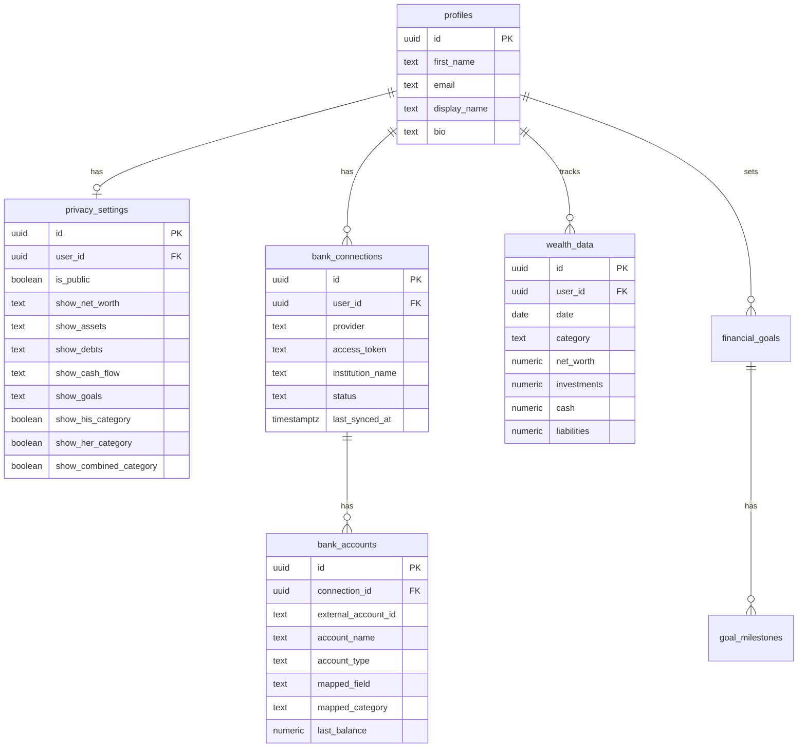

# feat: Privacy Controls, Excel/CSV Import, and Read-Only Bank Connections

## Overview

Three interconnected improvements to PathTwoFI that address the core friction points: (1) the public wealthboard is broken and exposes identity, (2) data entry is painful (25-field manual form), and (3) there's no automation for pulling bank data. These should be built in sequence since privacy is foundational, import removes immediate pain, and bank connections are the most complex.

## Problem Statement

**Privacy:** The public wealthboard (`/wealthboard`) returns empty data because RLS blocks all anon reads. Blog author profiles expose `email` and `first_name`. The source code contains the family name "Gilmore" in `fire-constants.ts`. Wife must remain fully anonymous.

**Data Entry:** The owner tracks everything in Excel but must manually re-enter 25+ fields into the wealthboard dialog. No carry-forward, no auto-calculation, no import. This is the biggest friction to actually using the app.

**Automation:** No bank feed integration exists. The owner must manually look up balances across multiple accounts every time they want to update.

## Proposed Solution

### Phase 1: Privacy & Public Data Layer (Foundation)

Make the public wealthboard work with controlled data exposure. Single-user manages all His/Her/Combined data (wife does not have a separate account).

#### 1.1 Database Changes

**Migration: Add privacy fields to profiles**

```sql
-- supabase/migrations/20260312000001_add_privacy_fields.sql
ALTER TABLE profiles
  ADD COLUMN display_name TEXT DEFAULT 'Anonymous',
  ADD COLUMN bio TEXT;
```

**Migration: Create privacy_settings table**

```sql
-- supabase/migrations/20260312000002_create_privacy_settings.sql
CREATE TABLE privacy_settings (
  id UUID PRIMARY KEY DEFAULT gen_random_uuid(),
  user_id UUID NOT NULL REFERENCES auth.users(id) ON DELETE CASCADE,
  is_public BOOLEAN DEFAULT FALSE,

  -- Per-section visibility: 'hidden' | 'percentage' | 'exact'
  show_net_worth TEXT DEFAULT 'exact' CHECK (show_net_worth IN ('hidden', 'percentage', 'exact')),
  show_assets TEXT DEFAULT 'percentage' CHECK (show_assets IN ('hidden', 'percentage', 'exact')),
  show_debts TEXT DEFAULT 'hidden' CHECK (show_debts IN ('hidden', 'percentage', 'exact')),
  show_cash_flow TEXT DEFAULT 'hidden' CHECK (show_cash_flow IN ('hidden', 'percentage', 'exact')),
  show_goals TEXT DEFAULT 'percentage' CHECK (show_goals IN ('hidden', 'percentage', 'exact')),
  show_his_category BOOLEAN DEFAULT FALSE,
  show_her_category BOOLEAN DEFAULT FALSE,
  show_combined_category BOOLEAN DEFAULT TRUE,

  created_at TIMESTAMPTZ DEFAULT NOW(),
  updated_at TIMESTAMPTZ DEFAULT NOW(),
  UNIQUE(user_id)
);

ALTER TABLE privacy_settings ENABLE ROW LEVEL SECURITY;
-- Owner full access
CREATE POLICY "Users manage own privacy" ON privacy_settings
  FOR ALL USING (auth.uid() = user_id);
-- Anon can read (needed to render public page)
CREATE POLICY "Public can read privacy settings" ON privacy_settings
  FOR SELECT TO anon USING (true);
```

**Migration: Create a SECURITY DEFINER function for public wealth data**

```sql
-- supabase/migrations/20260312000003_public_wealth_function.sql
CREATE OR REPLACE FUNCTION get_public_wealth_data()
RETURNS JSONB
LANGUAGE plpgsql
SECURITY DEFINER
SET search_path = public
AS $$
DECLARE
  result JSONB;
  settings RECORD;
  latest RECORD;
  entries JSONB;
BEGIN
  -- Get the first user's privacy settings (single-user app)
  SELECT * INTO settings FROM privacy_settings LIMIT 1;

  IF settings IS NULL OR NOT settings.is_public THEN
    RETURN jsonb_build_object('is_public', false);
  END IF;

  -- Get latest entry per allowed category
  SELECT jsonb_agg(row_to_json(w.*) ORDER BY w.date DESC)
  INTO entries
  FROM wealth_data w
  WHERE (
    (settings.show_combined_category AND w.category = 'Combined') OR
    (settings.show_his_category AND w.category = 'His') OR
    (settings.show_her_category AND w.category = 'Her')
  );

  RETURN jsonb_build_object(
    'is_public', true,
    'display_name', (SELECT display_name FROM profiles LIMIT 1),
    'show_net_worth', settings.show_net_worth,
    'show_assets', settings.show_assets,
    'show_debts', settings.show_debts,
    'show_cash_flow', settings.show_cash_flow,
    'show_goals', settings.show_goals,
    'entries', COALESCE(entries, '[]'::jsonb)
  );
END;
$$;
```

#### 1.2 Code Changes

| File | Change |
|------|--------|
| `lib/fire-constants.ts` | Remove "Gilmore" family name from comments |
| `app/wealthboard/page.tsx` | Call `get_public_wealth_data()` RPC instead of direct table query |
| `components/wealthboard/fire-progress-card.tsx` | Accept `granularity` prop to show exact / percentage / hidden |
| `components/wealthboard/asset-breakdown.tsx` | Respect privacy granularity settings |
| `components/wealthboard/cash-flow-card.tsx` | Respect privacy granularity settings |
| `app/dashboard/settings/page.tsx` | Wire up privacy settings form (currently non-functional) |
| `app/dashboard/wealthboard/actions.ts` | Add `getPrivacySettings()` and `updatePrivacySettings()` server actions |
| `types/wealth.types.ts` | Add `PrivacySettings` interface |

#### 1.3 Blog Anonymity

| File | Change |
|------|--------|
| `app/blog/[slug]/page.tsx` | Show `display_name` instead of profile email/first_name |
| `app/blog/page.tsx` | Same -- author shown as alias |

### Phase 2: Excel/CSV Import + Smart Entry

Remove the data entry pain. The user's existing Excel becomes the primary data source.

#### 2.1 New Dependencies

```
papaparse    -- CSV parsing (5.5s for 1M rows, streaming support)
exceljs      -- Excel parsing (accepts ArrayBuffer, streaming reader)
```

#### 2.2 Database Changes

```sql
-- supabase/migrations/20260312000004_wealth_data_unique.sql
-- Prevent duplicate entries for same date+category
ALTER TABLE wealth_data
  ADD CONSTRAINT wealth_data_unique_date_category
  UNIQUE (user_id, date, category);
```

#### 2.3 New Files

| File | Purpose |
|------|---------|
| `app/dashboard/wealthboard/import/page.tsx` | Import page with file upload + column mapper |
| `app/dashboard/wealthboard/import/actions.ts` | Server actions: `parseFile()`, `importWealthData()` |
| `components/wealthboard/import-wizard.tsx` | Multi-step client component: upload -> map columns -> preview -> confirm |
| `components/wealthboard/column-mapper.tsx` | Map CSV columns to wealth_data fields with auto-detection |
| `components/wealthboard/import-preview.tsx` | Preview table of rows to be imported |
| `lib/csv-parser.ts` | Wrapper around papaparse with column auto-detection |
| `lib/excel-parser.ts` | Wrapper around exceljs for .xlsx files |

#### 2.4 Import Flow

```
Upload file -> Parse to rows -> Auto-detect column mappings
  -> User adjusts mappings -> Select category (His/Her/Combined)
  -> Preview first 10 rows with mapped field names
  -> User confirms -> Batch upsert (ON CONFLICT update)
  -> Show result: X inserted, Y updated, Z skipped
```

#### 2.5 Smart Entry (Carry Forward + Auto-Calculate)

Modify existing `add-wealth-entry-dialog.tsx`:

1. **Carry forward:** On dialog open, fetch the latest entry for the selected category and pre-fill all fields
2. **Auto-calculate net_worth:** `investments + cash - liabilities` (shown as suggestion, user can override)
3. **Auto-calculate savings_rate:** `(monthly_savings / monthly_income) * 100` when both fields are filled
4. **Auto-calculate monthly_savings:** `monthly_income - monthly_expenses`
5. **Date default:** First day of current month

| File | Change |
|------|--------|
| `components/wealthboard/add-wealth-entry-dialog.tsx` | Add carry-forward, auto-calc, category-aware pre-fill |
| `app/dashboard/wealthboard/actions.ts` | Add `getLatestEntryForCarryForward()` action |

#### 2.6 Export (CSV)

| File | Purpose |
|------|---------|
| `app/dashboard/wealthboard/actions.ts` | Add `exportWealthDataCsv()` server action |
| `components/wealthboard/wealthboard-client.tsx` | Add "Export CSV" button next to "Add Entry" |

### Phase 3: Read-Only Bank Connections (Teller API)

Start with **Teller** (free for 100 connections, real bank APIs, no screen scraping). Add Plaid later if bank coverage is insufficient.

#### 3.1 New Dependencies

```
teller-connect-react  -- Teller's React SDK for the Link widget
```

#### 3.2 Database Changes

```sql
-- supabase/migrations/20260312000005_create_bank_connections.sql
CREATE TABLE bank_connections (
  id UUID PRIMARY KEY DEFAULT gen_random_uuid(),
  user_id UUID NOT NULL REFERENCES auth.users(id) ON DELETE CASCADE,
  provider TEXT NOT NULL DEFAULT 'teller' CHECK (provider IN ('teller', 'plaid')),
  access_token TEXT NOT NULL, -- encrypted via Supabase Vault
  institution_name TEXT NOT NULL,
  status TEXT NOT NULL DEFAULT 'active' CHECK (status IN ('active', 'stale', 'expired', 'disconnected')),
  last_synced_at TIMESTAMPTZ,
  created_at TIMESTAMPTZ DEFAULT NOW(),
  updated_at TIMESTAMPTZ DEFAULT NOW()
);

CREATE TABLE bank_accounts (
  id UUID PRIMARY KEY DEFAULT gen_random_uuid(),
  connection_id UUID NOT NULL REFERENCES bank_connections(id) ON DELETE CASCADE,
  external_account_id TEXT NOT NULL,
  account_name TEXT NOT NULL,
  account_type TEXT NOT NULL, -- checking, savings, credit_card, investment, etc.
  institution_name TEXT NOT NULL,
  -- Mapping to wealth_data fields
  mapped_field TEXT, -- e.g., 'checking_accounts', 'retirement_401k', 'credit_cards'
  mapped_category TEXT DEFAULT 'Combined' CHECK (mapped_category IN ('His', 'Her', 'Combined')),
  last_balance NUMERIC(12,2),
  last_synced_at TIMESTAMPTZ,
  created_at TIMESTAMPTZ DEFAULT NOW()
);

-- RLS: owner access only
ALTER TABLE bank_connections ENABLE ROW LEVEL SECURITY;
CREATE POLICY "Users manage own connections" ON bank_connections
  FOR ALL USING (auth.uid() = user_id);

ALTER TABLE bank_accounts ENABLE ROW LEVEL SECURITY;
CREATE POLICY "Users manage own accounts" ON bank_accounts
  FOR ALL USING (EXISTS (
    SELECT 1 FROM bank_connections
    WHERE bank_connections.id = bank_accounts.connection_id
    AND bank_connections.user_id = auth.uid()
  ));
```

#### 3.3 New Files

| File | Purpose |
|------|---------|
| `app/api/webhooks/teller/route.ts` | Route Handler for Teller webhooks (external caller, cannot use server action) |
| `app/dashboard/settings/connections/page.tsx` | Bank connections management UI |
| `components/wealthboard/connect-bank-button.tsx` | Teller Connect widget wrapper |
| `components/wealthboard/account-mapper.tsx` | Map bank accounts to wealth_data fields |
| `components/wealthboard/connection-status.tsx` | Show connection health badges |
| `app/dashboard/settings/connections/actions.ts` | Server actions: `saveBankConnection()`, `syncBankData()`, `disconnectBank()` |
| `supabase/functions/sync-bank-data/index.ts` | Edge Function for scheduled balance fetching |
| `lib/teller.ts` | Teller API client wrapper |

#### 3.4 Sync Strategy

- **Frequency:** Weekly via pg_cron + Edge Function. Manual "Sync Now" button available.
- **Merge strategy:** Bank connections only update the specific `mapped_field` columns. All other fields carried forward from last entry.
- **Snapshot strategy:** If no entry exists for the current month, create one (carry-forward non-bank fields from last entry, populate bank fields from fetched balances). If an entry exists, update only the bank-mapped fields.
- **Non-bank fields** (crypto, real_estate, etc.) are never touched by bank sync.

#### 3.5 Security

- Store `access_token` using [Supabase Vault](https://supabase.com/docs/guides/database/vault) (`vault.create_secret()`)
- Teller webhook signature verification in the Route Handler
- Environment variables: `TELLER_APP_ID`, `TELLER_SIGNING_SECRET`, `TELLER_CERTIFICATE` (mTLS cert for API calls)
- Never expose tokens client-side

---

## Technical Considerations

### Architecture

- **Public data layer:** SECURITY DEFINER function prevents RLS bypass while controlling exactly what data is exposed. Server components call this function via `supabase.rpc('get_public_wealth_data')`.
- **Import processing:** Server Actions handle file parsing. For large files (>1000 rows), consider chunked batch inserts to avoid Vercel function timeouts (default 10s on Hobby, 60s on Pro).
- **Bank data:** Route Handlers for webhooks (external callers). Edge Functions for scheduled sync (runs outside Vercel). Server Actions for user-initiated operations.

### Performance

- CSV parsing with PapaParse streaming mode handles large files without memory pressure
- Batch upserts using Supabase's `.upsert()` with `onConflict: 'user_id,date,category'`
- Public wealthboard data can be cached with `revalidate` in the server component (e.g., revalidate every 3600 seconds)

### Security

- Remove "Gilmore" from source code immediately
- SECURITY DEFINER function runs with elevated privileges -- audit carefully
- Bank tokens encrypted at rest via Vault
- Webhook endpoints verify signatures before processing
- Public data transformation happens server-side (never client-side filtering of sensitive data)

---

## Acceptance Criteria

### Phase 1: Privacy

- [ ] Public wealthboard at `/wealthboard` displays real wealth data (not empty/fallback)
- [ ] Privacy settings page allows toggling visibility per section (net worth, assets, debts, cash flow, goals)
- [ ] "Her" category data never exposes wife's real name or email
- [ ] Blog posts show display alias, not real name/email
- [ ] No real names in source code (fire-constants.ts cleaned)
- [ ] Display name defaults to "Anonymous" until configured
- [ ] `is_public` toggle controls whether any wealth data appears publicly

### Phase 2: Import

- [ ] Upload CSV or XLSX file from the wealthboard dashboard
- [ ] Column auto-detection with manual override
- [ ] Preview rows before confirming import
- [ ] Duplicate handling via upsert (same user + date + category = update)
- [ ] Carry-forward pre-fills form with latest entry values for selected category
- [ ] Net worth auto-calculated from sub-fields (with manual override)
- [ ] Savings rate auto-calculated from income/savings
- [ ] CSV export of all wealth data

### Phase 3: Bank Connections

- [ ] Connect bank via Teller Link widget
- [ ] Map bank accounts to wealth_data fields and categories
- [ ] Manual "Sync Now" fetches latest balances
- [ ] Weekly automated sync via Edge Function
- [ ] Connection status indicators (active/stale/expired)
- [ ] Re-authentication flow for expired connections
- [ ] Bank sync only updates mapped fields, never overwrites manual entries

---

## Dependencies & Risks

| Risk | Impact | Mitigation |
|------|--------|------------|
| Teller bank coverage insufficient | User's banks not supported | Fall back to Plaid (paid) or manual entry |
| Vercel function timeout on large imports | Import fails silently | Chunk batch inserts, show progress |
| SECURITY DEFINER function exposes too much | Privacy leak | Extensive testing, code review of SQL function |
| User's Excel format is unusual | Column mapper fails | Build flexible mapper with manual override |
| Supabase Vault not available on free tier | Cannot encrypt tokens | Use server-side encryption with env var key as fallback |
| Teller requires mTLS certificates | More complex setup | Document setup steps clearly |

---

## Implementation Sequence

```
Week 1:  Phase 1 -- Privacy settings schema + public data function + clean source code
Week 2:  Phase 1 -- Privacy settings UI + public wealthboard fix + blog anonymity
Week 3:  Phase 2 -- CSV/Excel parser + import wizard UI
Week 4:  Phase 2 -- Carry-forward + auto-calculate + export
Week 5:  Phase 3 -- Teller integration + bank connections schema
Week 6:  Phase 3 -- Account mapping + sync Edge Function + webhooks
```

---

## ERD: New Tables



---

## References

### Internal
- `lib/fire-constants.ts:2` -- Contains "Gilmore" family name (must remove)
- `app/wealthboard/page.tsx` -- Broken public wealthboard (RLS blocks anon)
- `components/wealthboard/add-wealth-entry-dialog.tsx` -- 25-field manual form (no carry-forward)
- `app/dashboard/settings/page.tsx` -- Settings UI exists but is non-functional
- `middleware.ts:37` -- Public routes list

### External
- [Teller API Docs](https://teller.io/docs/api) -- Free for 100 connections
- [Plaid API Docs](https://plaid.com/docs/api/) -- Fallback if Teller coverage insufficient
- [PapaParse](https://www.papaparse.com/) -- CSV parsing library
- [ExcelJS](https://www.npmjs.com/package/exceljs) -- Excel parsing library
- [Supabase Vault](https://supabase.com/docs/guides/database/vault) -- Secret storage
- [Supabase Edge Functions](https://supabase.com/docs/guides/functions) -- Scheduled sync
- [Supabase SECURITY DEFINER](https://supabase.com/docs/guides/database/postgres/row-level-security) -- Public data access pattern

### Best Practices Sources
- Teller recommended for personal projects: free tier, real bank APIs, no screen scraping
- Monarch Money's CSV import pattern: auto-detect columns, preview, merge/replace modes
- Finance blogger anonymity: use aliases, share percentages over exact dollars, domain privacy
- CFPB Section 1033 (open banking) is currently stayed by court order -- do not depend on it
